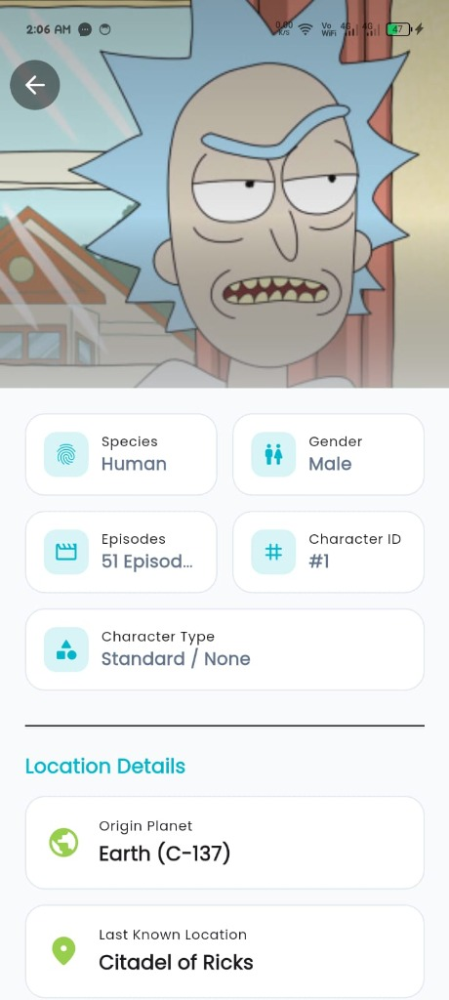
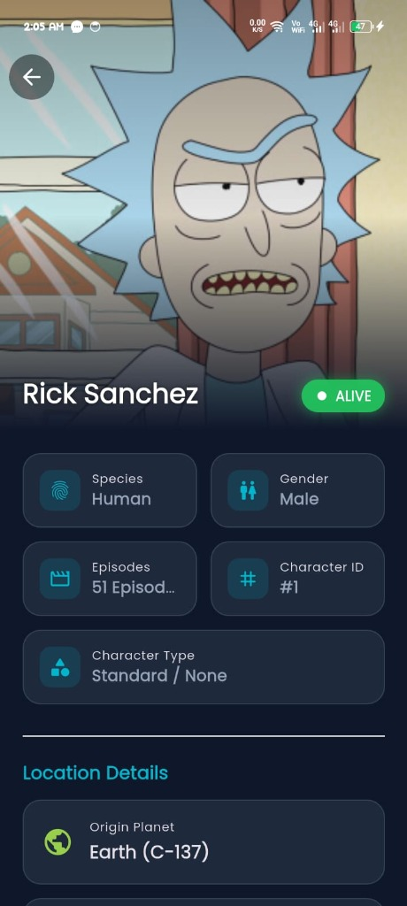
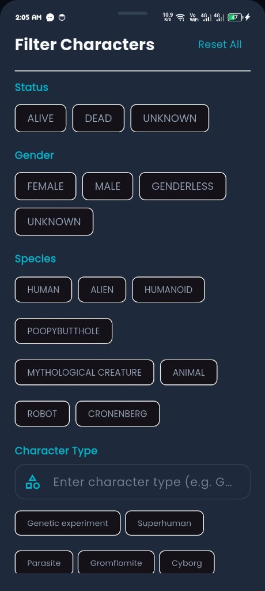
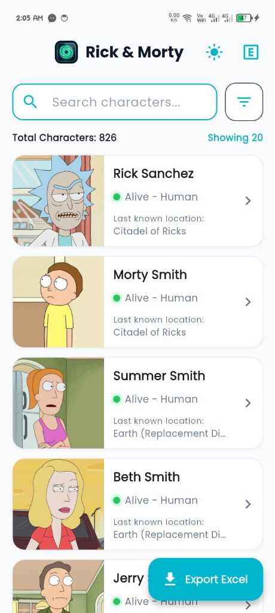
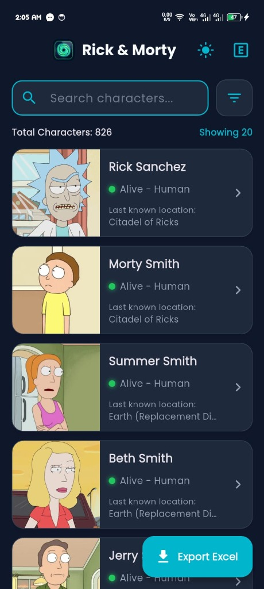
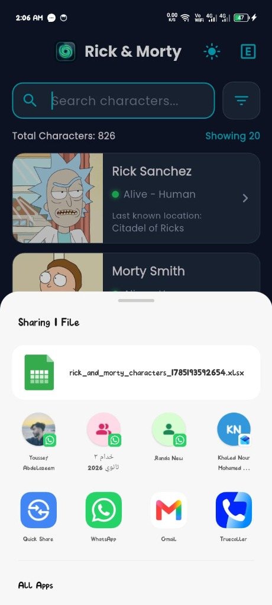

# 🧪 Rick & Morty Explorer - Flutter Application

A modern, production-grade Flutter application built with **Clean Architecture**, **BLoC/Cubit State Management**, **Dependency Injection (GetIt)**, **Centralized AppRouter**, and **Dio Networking** to explore characters from the official Rick & Morty REST API.

---

## 📱 Project Overview & Key Features

- **⚡ Infinite Scroll Pagination**: Smoothly loads pages of characters on demand as the user scrolls.
- **🔍 Real-time Search with Debounce**: Fast character search by name with 500ms input debouncing.
- **🎛️ Multi-Criteria Filters**: Filter characters by `Status` (Alive, Dead, Unknown), `Gender`, `Species`, and custom `Type`.
- **🏷️ Interactive Filter Chips**: View active filter chips with quick `(X)` removal for single filters or "Clear All".
- **📊 Dynamic Excel Export & Sharing**: Export loaded characters directly to an `.xlsx` Excel sheet and launch the native OS Share flyout / default spreadsheet viewer.
- **🌗 Dark & Light Cyber Themes**: Custom sci-fi cyber theme with instant theme switching using Google Fonts (`Poppins`).
- **🚀 Native Splash Screen**: Customized native splash screen featuring a rounded glowing portal app logo.
- **🧪 Unit & Widget Testing**: Comprehensive unit tests for state management, pagination, filtering, and model JSON parsing.

---

## 📸 App Screenshots & Live Demo

### 📱 Screenshots Matrix

| Character Detail (Light) | Character Detail (Dark) | Multi-Criteria Filters |
| :---: | :---: | :---: |
|  |  |  |

| Main List (Light Mode) | Main List (Dark Mode) | Excel Export & Native Sharing |
| :---: | :---: | :---: |
|  |  |  |

---

### 🎥 App Demonstration Video
- **Video Link**: [Watch Video Demo on Google Drive](https://drive.google.com/file/d/1GdfSXM67gEmZas2wbJW_xbblloIbfQ8Y/view?usp=sharing)

---

## 🏗️ Architecture & Folder Structure

Built using **Clean Architecture** principles separated into distinct layers:

```
lib/
├── core/
│   ├── constants/
│   │   └── api_endpoints.dart         # Centralized API URLs & Endpoints
│   ├── di/
│   │   └── injection_container.dart   # GetIt Dependency Injection Container
│   ├── network/
│   │   └── api_client.dart            # Dio Client with Error Interception
│   ├── routing/
│   │   ├── app_router.dart            # Centralized onGenerateRoute Navigation
│   │   └── routes.dart                # Named Route String Constants
│   ├── theme/
│   │   ├── app_colors.dart            # Palette Tokens (Portal Green, Cyber Neon)
│   │   └── app_theme.dart             # Dark & Light ThemeData
│   └── utils/
│       └── excel_exporter.dart        # Excel (.xlsx) Generator & Platform Share
│
└── features/
    └── character/
        ├── data/
        │   ├── datasources/           # CharacterRemoteDataSource Implementation
        │   ├── models/                # CharacterModel & CharacterResponseModel
        │   └── repositories/          # CharacterRepositoryImpl Implementation
        ├── domain/
        │   ├── entities/              # Pure CharacterEntity
        │   ├── repositories/          # CharacterRepository Interface
        │   └── usecases/              # Domain UseCases (GetCharacters, GetSingleCharacter, etc.)
        └── presentation/
            ├── cubit/                 # CharacterCubit & CharacterState
            ├── screens/               # CharacterListScreen & CharacterDetailScreen
            └── widgets/               # CharacterCard, FilterBottomSheet, Shimmer, etc.
```

---

## 🛠️ Technology Stack & Dependencies

| Library / Package | Purpose |
| :--- | :--- |
| **`flutter_bloc`** | State management using Cubit pattern |
| **`get_it`** | Service locator for Dependency Injection |
| **`dio`** | Powerful HTTP client with timeout & error handling |
| **`equatable`** | Value equality comparison for BLoC states |
| **`excel`** | Generation of `.xlsx` spreadsheets |
| **`share_plus`** | Native mobile & desktop file sharing flyout |
| **`flutter_native_splash`** | Native app launcher splash screen |
| **`cached_network_image`** | Network image caching with fallback loading |
| **`google_fonts`** | Typography integration (`Poppins`) |
| **`shimmer`** | Futuristic loading placeholder effects |

---

## ⚙️ Getting Started & Installation

### Prerequisites
- **Flutter SDK**: `>=3.19.0`
- **Dart SDK**: `>=3.3.0`

### 1️⃣ Clone the Repository
```bash
git clone https://github.com/YOUR_USERNAME/YOUR_REPOSITORY_NAME.git
cd flutter_task
```

### 2️⃣ Install Dependencies
```bash
flutter pub get
```

### 3️⃣ Run Unit & Widget Tests
```bash
flutter test
```

### 4️⃣ Run static code analysis
```bash
flutter analyze
```

### 5️⃣ Run the Application
```bash
flutter run
```

---

## 🧪 Testing

The codebase includes thorough automated tests located in the `test/` directory:
- `test/character_cubit_test.dart`: Validates pagination, filter resetting, explicit filter removal, and export state resetting.
- `test/widget_test.dart`: Validates JSON parsing for all 4 Bruno collection API endpoints.

To run tests:
```bash
flutter test
```

---

## 📄 License
This project is open-source under the MIT License.
